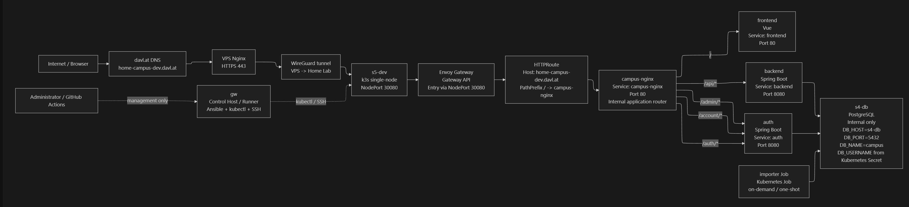
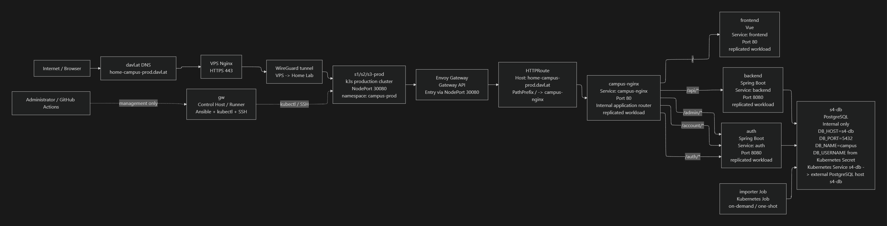
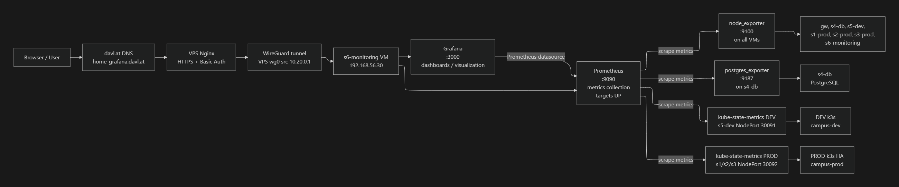

# Architecture

## Target

Campus++ targets a home-only Kubernetes lab on one physical PC with VM roles.
Only the home lab target is active. Older non-home targets are intentionally
absent from the current architecture.

The repository documents the architecture, deployment model, and operational
checks. It does not store VPS certificates, private keys, htpasswd files, or
secret values.

## Server Roles

- `gw`: control host, GitHub Actions runner host, Ansible entry point
- `s4-db`: internal PostgreSQL host
- `s5-dev`: single-node dev k3s cluster
- `s1-prod`, `s2-prod`, `s3-prod`: prod k3s HA cluster
- `s6-monitoring`: Prometheus and Grafana host

## Environments

Dev:

- cluster: single-node k3s on `s5-dev`
- namespace: `campus-dev`
- public host: `home-campus-dev.davl.at`
- edge port: k3s NodePort `30080`

Prod:

- cluster: k3s HA on `s1-prod`, `s2-prod`, `s3-prod`
- namespace: `campus-prod`
- public host: `home-campus-prod.davl.at`
- edge port: k3s NodePort `30080`
- app workloads run multiple replicas, but strict pod placement and PDB rules
  are not part of the current scope.

Database:

- PostgreSQL runs on `s4-db`.
- PostgreSQL is internal only.
- Application config keeps `DB_HOST=s4-db`.
- Kubernetes gets the stable `s4-db` name through Service and EndpointSlice
  aliases in both app namespaces.

Monitoring:

- Prometheus runs on `s6-monitoring`.
- Grafana runs on `s6-monitoring`.
- Grafana is the only external monitoring entry point.
- Grafana external traffic is proxied by VPS Nginx over WireGuard directly to
  `s6-monitoring:3000`; `gw` also has private access for operational checks.

## Visual Diagrams

The diagrams below show the dev, production, and monitoring runtime paths using
VM roles and hostnames rather than fixed lab IP addresses.







## Public Edge

The public edge is VPS Nginx, not `gw` Nginx. The `gw` VM remains a control and
home lab entry host, but it is not the public HTTPS edge.

The public edge Nginx configuration lives on the VPS as runtime infrastructure
and is not stored in this repository.

Runtime-only VPS paths:

```text
/etc/nginx/sites-available/home-campus-routing.conf
/etc/nginx/sites-available/home-grafana-routing.conf
/etc/nginx/.htpasswd-home-grafana
/etc/letsencrypt/live/home-campus/
/etc/letsencrypt/live/home-grafana/
```

## Traffic Path

```text
internet
  -> davl.at DNS
  -> VPS Nginx / HTTPS
  -> WireGuard
  -> home lab
  -> k3s NodePort / Envoy Gateway
  -> Campus++ app
```

Grafana monitoring path:

```text
internet
  -> davl.at DNS
  -> VPS Nginx / HTTPS / basic auth
  -> WireGuard
  -> s6-monitoring:3000
  -> Grafana
```
