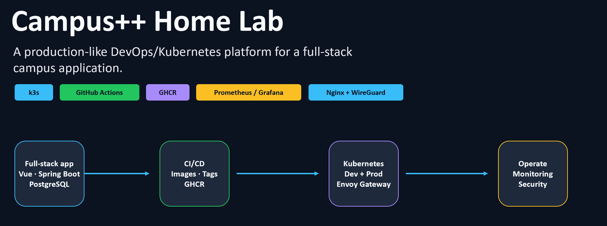
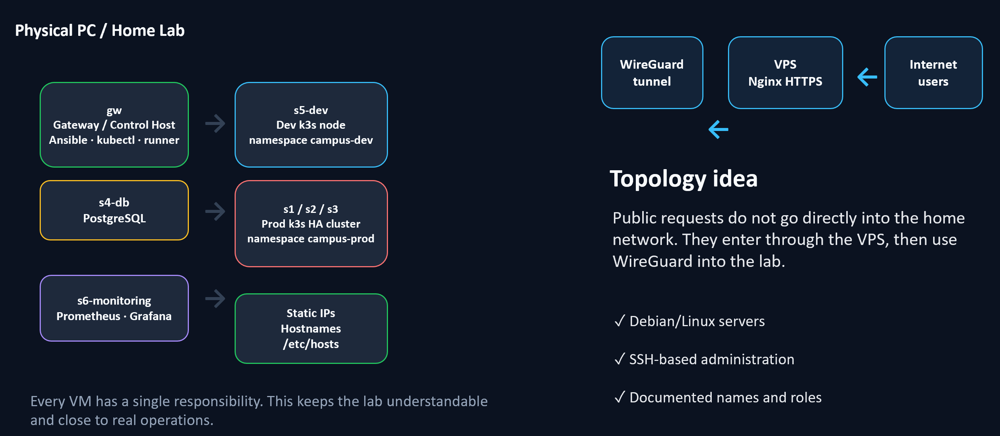
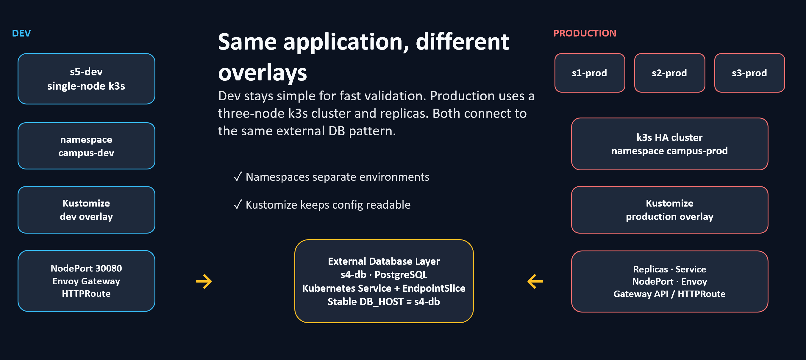
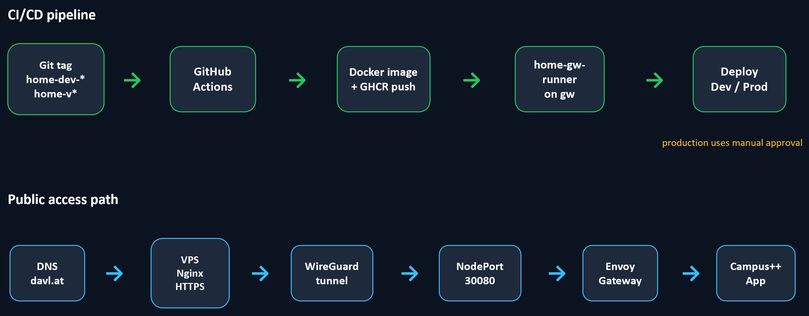
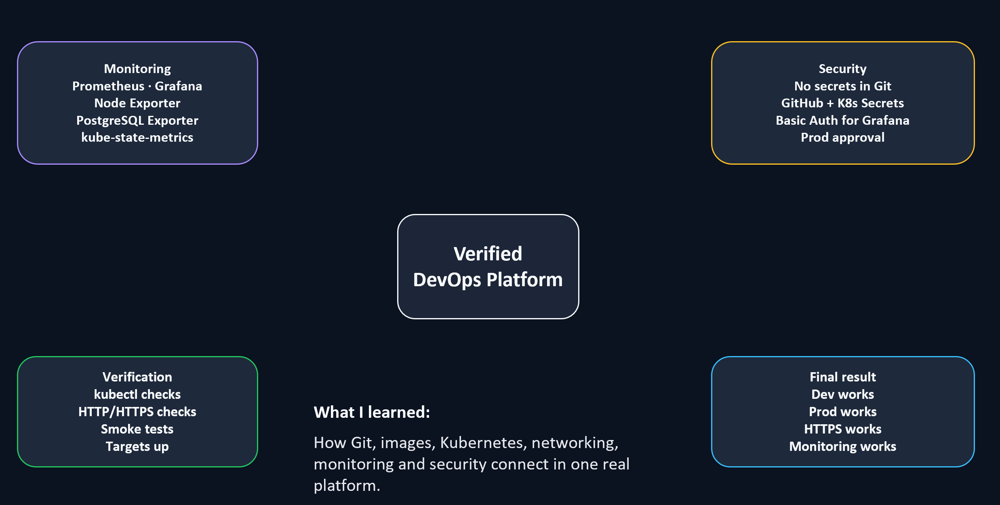
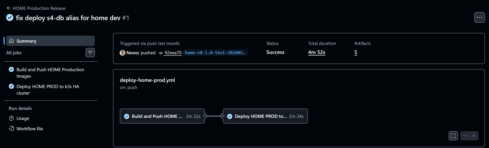
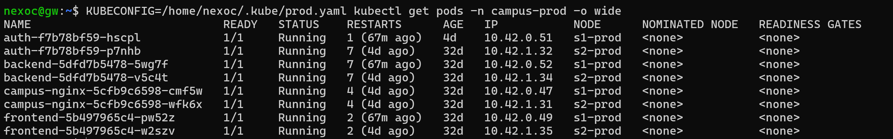
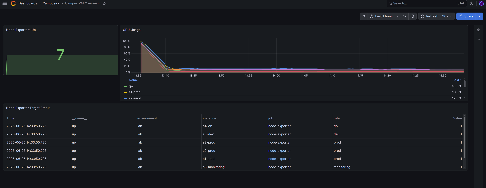
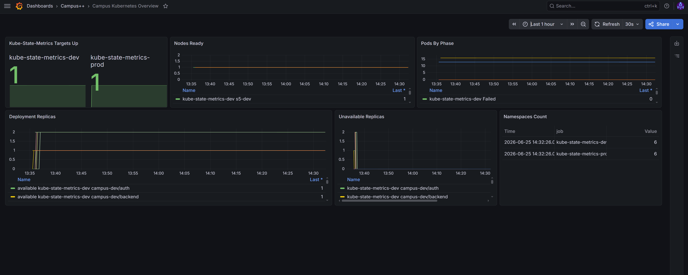
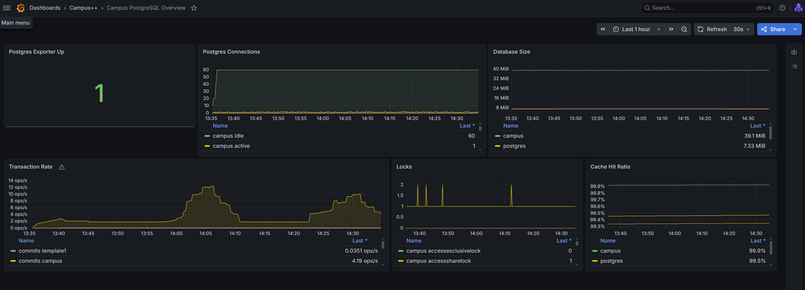

# Presentation Slides

Screenshot-based presentation summary for Campus++.

## 1. Overview

## 2. Infrastructure

## 3. Kubernetes Environments

## 4. Delivery And External HTTPS Access

## 5. Monitoring, Security, And Final Result

## Runtime Evidence

